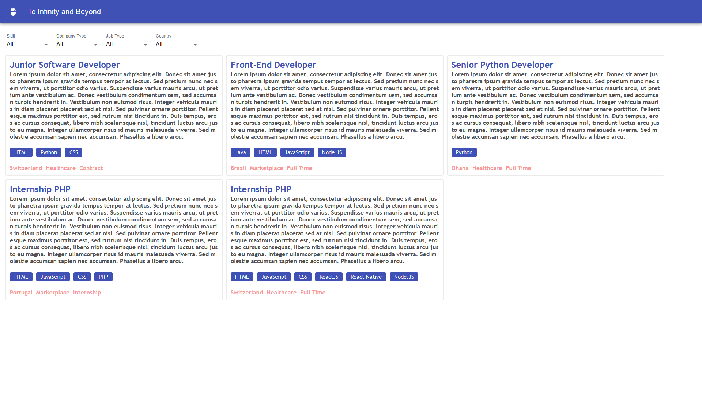

Hosted on: https://taikaijob.herokuapp.com/

# Preview



# Cloning the project
First of all you will need the project in your PC
```https://github.com/eduardoedson/TAIKAIJOB-Test.git```
Then, go to the project directory ```cd TAIKAIJOB-Test``` and install all dependencies ```yarn install```

OBS: I used yarn in this project, to download click [https://classic.yarnpkg.com/en/docs/install/](here).

# Run Project
After all just type ```yarn start``` and open [http://localhost:3000](http://localhost:3000).
